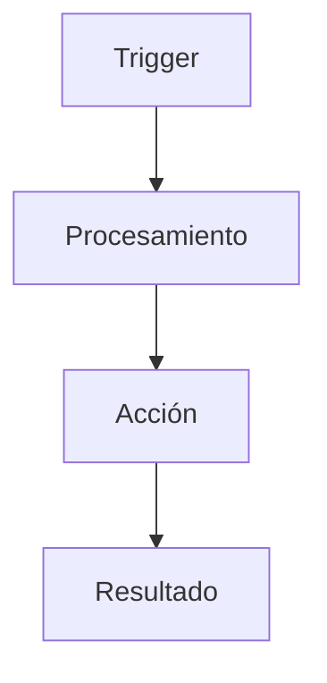

# 🔧 Mi Viaje de Aprendizaje con N8N

> Documentación completa de mi experiencia aprendiendo N8N - Desde conceptos básicos hasta integraciones avanzadas

## 📋 Tabla de Contenidos

- [🚀 Introducción](#introducción)
- [📚 Documentación](#documentación)
- [🔄 Workflows](#workflows)
- [🛠️ Scripts y Herramientas](#scripts-y-herramientas)
- [🤝 Contribuir](#contribuir)
- [📄 Licencia](#licencia)

## 🚀 Introducción

Este repositorio documenta mi viaje de aprendizaje con N8N, incluyendo conceptos, ejemplos prácticos, workflows y integraciones. Está diseñado tanto para mi referencia personal como para ayudar a otros que estén aprendiendo N8N.

### ¿Qué encontrarás aquí?

- **Conceptos básicos** y fundamentos de N8N
- **Documentación detallada** de nodos y funcionalidades
- **Workflows de ejemplo** organizados por dificultad
- **Casos de uso reales** con implementaciones completas
- **Scripts de utilidad** para instalación y mantenimiento
- **Integraciones avanzadas** (MCP Server, Claude Desktop, etc.)

## 📚 Documentación

### Conceptos Básicos
- [¿Qué es N8N?](docs/conceptos-basicos/que-es-n8n.md)
- [Instalación y Configuración](docs/conceptos-basicos/instalacion.md)
- [Interface de Usuario](docs/conceptos-basicos/interface-usuario.md)
- [Mi Primer Workflow](docs/conceptos-basicos/primer-workflow.md)

### Nodos y Componentes
- [HTTP Request](docs/nodos/http-request.md)
- [Webhook](docs/nodos/webhook.md)
- [Bases de Datos](docs/nodos/database/)
- [APIs Populares](docs/nodos/apis/)

### Casos de Uso
- [Automatización de Email](docs/casos-uso/automatizacion-email.md)
- [Procesamiento de Datos](docs/casos-uso/procesamiento-datos.md)
- [Sistema de Notificaciones](docs/casos-uso/notificaciones.md)

## 🔄 Workflows

### Por Nivel de Dificultad
- **Principiantes**: [workflows/ejemplos/basicos/](workflows/ejemplos/basicos/)
- **Intermedios**: [workflows/ejemplos/intermedios/](workflows/ejemplos/intermedios/)
- **Avanzados**: [workflows/ejemplos/avanzados/](workflows/ejemplos/avanzados/)

### Plantillas Reutilizables
- [Templates](workflows/templates/)

## 🛠️ Scripts y Herramientas

- [Scripts de Instalación](scripts/instalacion/)
- [Utilidades de Backup](scripts/backup/)
- [Herramientas de Desarrollo](scripts/utilidades/)


## 🤝 Contribuir

Si encuentras errores o tienes sugerencias, por favor:

1. Abre un [Issue](../../issues)
2. Haz un Fork del repositorio
3. Crea una rama para tu feature
4. Envía un Pull Request

Ver [CONTRIBUTING.md](CONTRIBUTING.md) para más detalles.

## 📄 Licencia

Este proyecto está bajo la Licencia MIT - ver [LICENSE](LICENSE) para detalles.

## 🔗 Enlaces Útiles

- [N8N Official Documentation](https://docs.n8n.io/)
- [N8N Community](https://community.n8n.io/)
- [N8N GitHub](https://github.com/n8n-io/n8n)
- [Mi Blog](tu-blog-url) - Artículos sobre N8N

---

⭐ Si este repositorio te ayuda, ¡dale una estrella!
```

## 3. Plantillas para Documentación

### Template para Documentar Nodos

```markdown
# [Nombre del Nodo]

## Descripción
Breve descripción de qué hace el nodo.

## Configuración

### Parámetros Principales
| Parámetro | Tipo | Requerido | Descripción |
|-----------|------|-----------|-------------|
| URL | String | Sí | URL del endpoint |
| Method | Select | Sí | Método HTTP |

### Configuración Avanzada
- Headers personalizados
- Autenticación
- Timeout

## Ejemplos de Uso

### Ejemplo Básico
```json
{
  "node_config": "ejemplo aquí"
}
```

### Ejemplo Avanzado
Descripción del caso de uso complejo.

## Casos de Uso Comunes
1. Integración con API REST
2. Webhook receiver
3. Data transformation

## Errores Comunes
- Error 1: Descripción y solución
- Error 2: Descripción y solución

## Tips y Mejores Prácticas
- Tip 1
- Tip 2
- Tip 3

## Enlaces Relacionados
- [Documentación oficial](url)
- [Workflows relacionados](../workflows/)
```

### Template para Workflows

```markdown
# [Nombre del Workflow]

## Descripción
Qué hace este workflow y para qué sirve.

## Nivel de Dificultad
🟢 Principiante / 🟡 Intermedio / 🔴 Avanzado

## Nodos Utilizados
- HTTP Request
- Webhook
- Email
- etc.

## Flujo del Workflow



## Configuración Paso a Paso

### Paso 1: Configurar Trigger
Instrucciones detalladas...

### Paso 2: Procesar Datos
Instrucciones detalladas...

### Paso 3: Acción Final
Instrucciones detalladas...

## Variables y Expresiones

```javascript
// Ejemplos de código JavaScript usado
const data = $node["HTTP Request"].json;
return data.map(item => ({
  id: item.id,
  name: item.name
}));
```

## Archivo del Workflow

[📁 Descargar workflow](../workflows/ejemplos/nombre-workflow.json)

