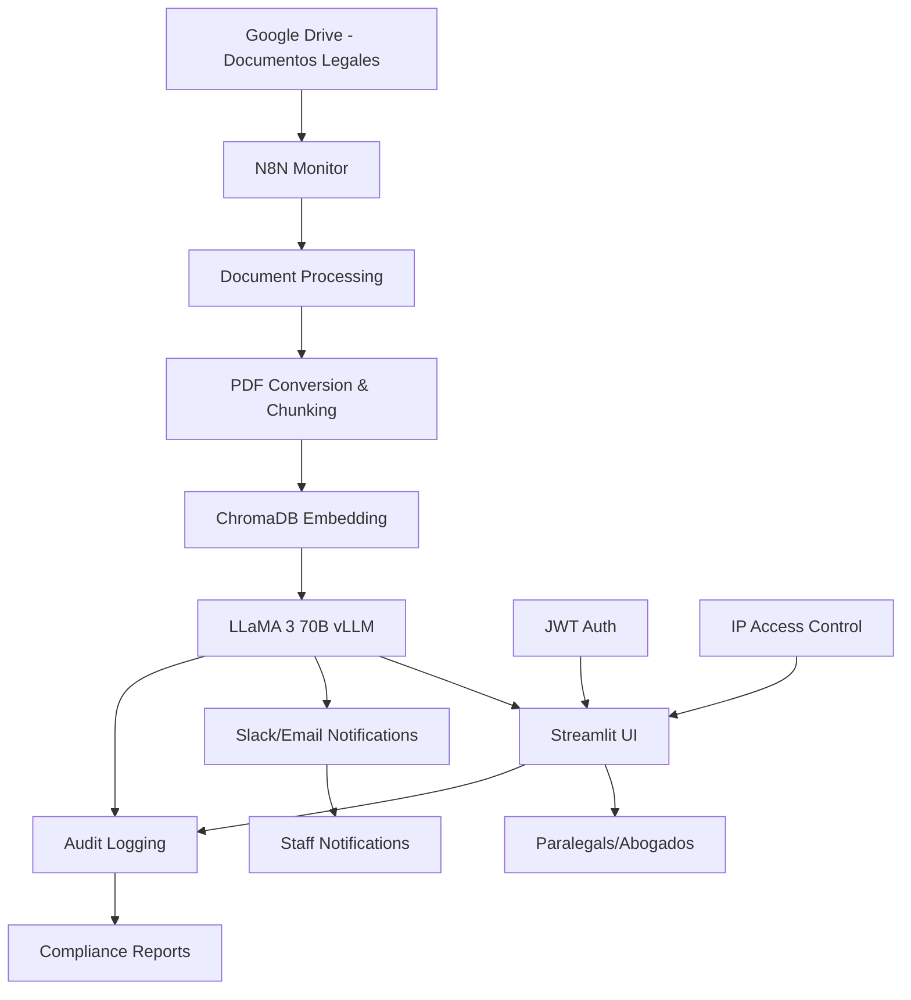

# Sistema de Asistente Legal con IA - Guía de Recursos y Arquitectura

## Introducción

Esta documentación compila los recursos necesarios para construir un sistema de asistente legal automatizado usando N8N, IA y tecnologías de RAG (Retrieval-Augmented Generation). El sistema está diseñado para automatizar tareas legales como redacción de documentos, análisis de contratos y consultas sobre jurisprudencia.

## Arquitectura Detallada del Sistema (Caso Real $35K)

### Flujo de Datos Principal



### Workflows N8N Automatizados

1. **Monitor de Documentos**
   - Vigilancia de carpeta Google Drive compartida
   - Detección automática de nuevos archivos legales
   - Trigger de procesamiento inmediato

2. **Pipeline de Procesamiento**
   - Conversión automática de PDFs
   - Chunking inteligente de documentos
   - Generación de embeddings en ChromaDB
   - Indexación para búsqueda vectorial

3. **Generación de Resúmenes**
   - Job automático de análisis con LLM
   - Extracción de puntos clave
   - Routing de resultados por Slack/email
   - Asignación automática a paralegales

4. **Sistema Q&A en Tiempo Real**
   - Procesamiento de consultas vía UI
   - RAG retrieval + LLM generation
   - Respuestas contextuales instantáneas
   - Logging completo para auditoría

### Infraestructura y Costos

**Setup Inicial:** $35,000 USD
- Desarrollo e implementación
- Configuración de infraestructura
- Migración de datos existentes
- Entrenamiento del equipo

**Costos Operativos Mensuales:** ~$1,200 USD
- CoreWeave GPU hosting (dual A100)
- ChromaDB hosting
- N8N hosting
- Monitoreo y mantenimiento

### Stack Tecnológico

**Core del Sistema:**
- **Orquestador**: N8N (Workflows y automatización)
- **LLM**: LLaMA 3 70B (quantizado con vLLM en CoreWeave)
- **Infraestructura**: Dual A100 GPUs (CoreWeave)
- **Base de Datos Vectorial**: ChromaDB
- **Framework RAG**: LlamaIndex
- **UI Frontend**: Streamlit (interfaz web)
- **Autenticación**: JWT + IP access controls
- **Procesamiento**: PDF parsing + document chunking
- **Monitoreo**: Full audit logging + compliance reporting

## Recursos de Aprendizaje

### 1. Curso Principal - Automatización con N8N

**📚 Recurso:** [AI Automation: Build LLM Apps & AI-Agents with n8n & APIs](https://www.udemy.com/course/ai-automation-build-llm-apps-ai-agents-with-n8n-apis/)

**Tipo:** Curso Pago (Udemy)  
**Nivel:** Principiante → Avanzado  
**Duración Estimada:** 8-12 horas

**Contenido Clave:**
- Construcción de workflows LLM con N8N
- Integración de bases de datos vectoriales (ChromaDB)
- Pipelines RAG para documentos legales
- Integración de LLMs open-source (LLaMA 3)
- Casos de uso reales en automatización legal

**Prioridad:** 🔴 ALTA - Base fundamental del sistema

---

### 2. Despliegue de IA Privada

**📺 Recurso:** [How to Build a Private AI Chatbot with Llama 3.1 and Cloudflare](https://www.youtube.com/watch?v=10-kiyJNr8s)

**Tipo:** Tutorial Gratuito (YouTube)  
**Nivel:** Intermedio  
**Duración:** ~45 minutos

**Contenido Clave:**
- Despliegue local de Llama 3.1 con Ollama
- Configuración de Cloudflare Workers AI
- Escalabilidad serverless y edge computing
- Autenticación JWT para cumplimiento legal
- Consideraciones de privacidad y seguridad

**Prioridad:** 🟡 MEDIA - Importante para producción

---

### 3. Implementación RAG con ChromaDB

**📺 Recurso:** [RAG using ChromaDB & LlamaIndex](https://www.youtube.com/watch?v=Is6qyWLVfC8)

**Tipo:** Tutorial Gratuito (YouTube)  
**Nivel:** Intermedio  
**Duración:** ~30 minutos

**Contenido Clave:**
- Configuración persistente de ChromaDB
- Integración con LlamaIndex
- Sistemas Q&A para documentos legales
- Procesamiento de datasets PDF reales
- Logging de cumplimiento y auditoría

**Prioridad:** 🔴 ALTA - Core del sistema RAG

---

### 4. Caso de Estudio - Escalabilidad

**💬 Recurso:** [Trying to build self-hosted AI to automate legal drafting using 10K+ past documents](https://www.reddit.com/r/legaltech/comments/1jrkfvs/trying_to_build_selfhosted_ai_to_automate_legal/)

**Tipo:** Discusión Comunitaria (Reddit)  
**Nivel:** Avanzado  
**Audiencia:** LegalTech professionals

**Insights Clave:**
- Desafíos de escalabilidad con 10K+ documentos
- Análisis de costos de GPU para procesamiento
- Composición de equipos técnico-legales
- Experiencias reales de abogados implementando IA
- Consideraciones de compliance y ética

**Prioridad:** 🟡 MEDIA - Lecciones aprendidas

---

### 5. Blueprint de Implementación Comercial

**💰 Recurso:** [Just closed a $35,000 deal with a law firm](https://www.reddit.com/r/n8n/comments/1kt8ag5/just_closed_a_35000_deal_with_a_law_firm/)

**Tipo:** Caso de Éxito Real (Reddit)  
**Nivel:** Profesional  
**Valor Comercial:** $35,000 USD

**Detalles del Proyecto:**
- **Cliente:** Bufete de abogados mediano
- **Duración:** Proyecto único con mantenimiento mensual
- **Costo Setup:** $35,000 USD
- **Costo Operativo:** ~$1,200/mes (hosting GPU)
- **ROI Cliente:** Recuperación en 1 trimestre

**Stack Tecnológico Implementado:**
- **LLM:** LLaMA 3 70B (quantizado + acelerado con vLLM)
- **Infraestructura:** CoreWeave con dual A100 GPUs
- **Vector DB:** ChromaDB para embeddings y retrieval
- **RAG Framework:** LlamaIndex
- **Orquestador:** N8N (automatización completa)
- **UI:** Streamlit (interfaz web limpia)
- **Seguridad:** JWT auth + IP controls + audit logging

**Casos de Uso Específicos:**
- Análisis interno de jurisprudencia y precedentes
- Procesamiento automático de contratos y filings
- Q&A complejo sobre documentos legales
- Resúmenes automáticos de documentos
- Sistema completamente privado (sin APIs externas)

**Prioridad:** 🔴 CRÍTICA - Validación comercial y técnica real

## Plan de Implementación

### Fase 1: Fundamentos y Setup (Semanas 1-3)
1. **✅ Completar curso de Udemy** sobre N8N + AI automation
2. **🔧 Configurar entorno de desarrollo**
   - N8N local o cloud
   - ChromaDB setup
   - Streamlit basic UI
3. **🧪 POC con documentos de prueba**
   - 5-10 PDFs legales sample
   - Workflow básico de ingestion
   - Q&A simple funcional

### Fase 2: RAG Pipeline Completo (Semanas 4-6)
1. **📚 Implementar ChromaDB + LlamaIndex**
   - Configuración persistente
   - Embeddings optimization
   - Retrieval testing
2. **🤖 Integrar LLaMA 3 70B**
   - Setup con vLLM (local o CoreWeave)
   - Quantización y optimización
   - API endpoints funcionales
3. **🔄 N8N Workflows avanzados**
   - Monitor de Google Drive
   - Auto-processing pipeline
   - Notification system

### Fase 3: UI y Experiencia Usuario (Semanas 7-8)
1. **🎨 Streamlit UI profesional**
   - Chat interface
   - Document upload
   - Search functionality
2. **🔐 Seguridad y Auth**
   - JWT implementation
   - IP access controls
   - Audit logging system
3. **📊 Dashboard y reporting**
   - Usage metrics
   - Compliance reports
   - Performance monitoring

### Fase 4: Despliegue y Optimización (Semanas 9-10)
1. **☁️ Infraestructura production**
   - CoreWeave GPU setup
   - Backup strategies
   - Monitoring alerts
2. **🧪 Testing y QA completo**
   - Load testing
   - Accuracy evaluation
   - Security penetration testing
3. **📖 Documentación y handover**
   - User training materials
   - Technical documentation
   - Maintenance procedures

### Fase 5: Escalabilidad y Negocio (Semanas 11-12)
1. **📈 Productización del sistema**
   - Template workflows
   - Deployment automation
   - Client onboarding process
2. **💼 Modelo de negocio**
   - Pricing strategy ($25-50K range)
   - Sales materials
   - Case studies documentation
3. **🚀 Expansión a otros sectores**
   - Finance vertical
   - Healthcare compliance
   - Consulting knowledge management

## Insights Clave del Caso Real

### Factores de Éxito Comercial

1. **Privacidad como Ventaja Competitiva**
   - Bufetes no pueden usar ChatGPT/Claude por policies
   - Datos sensibles requieren control total
   - Soberanía de datos es crítica en sector legal

2. **N8N como Diferenciador**
   - Elimina necesidad de backend tradicional
   - Permite a paralegales modificar workflows
   - Reduce dependencia de IT interno
   - Implementación 10x más rápida

3. **Pricing y Posicionamiento**
   - $35K se considera "subvalorado" por el desarrollador
   - Competencia directa: equipos AI internos ($200K+/año)
   - Recuperación de inversión en 1 trimestre
   - Modelo sostenible con $1,200/mes operativo

4. **LLaMA 3 70B Production-Ready**
   - Calidad comparable a GPT-4 en casos profesionales
   - Quantización permite deployment eficiente
   - vLLM optimiza rendimiento significativamente

### Lecciones Aprendidas

**✅ Lo que Funciona:**
- Clientes quieren soluciones llave en mano
- Privacidad > Features en sectores regulados
- N8N reduce complejidad técnica dramáticamente
- Self-hosting es viable y preferido

**⚠️ Consideraciones:**
- GPU hosting representa mayor costo operativo
- Setup inicial requiere expertise técnico significativo
- Compliance y auditoría son requisitos no opcionales
- UI debe ser extremadamente simple para adopción

### Oportunidades de Expansión

**Sectores Objetivo:**
- **Legal**: Bufetes medianos y grandes
- **Finance**: Wealth management, compliance
- **Healthcare**: Análisis de historiales, diagnósticos
- **Consulting**: Knowledge management, proposals

**Modelo de Productización:**
- "PrivateGPT for Professionals"
- Setup: $25-50K según complejidad
- Mensual: $800-2,000 según uso
- Vertical específico por industria

## Workflows N8N Específicos del Caso

### 1. Document Ingestion Workflow
```json
{
  "nodes": [
    {
      "name": "Google Drive Monitor",
      "type": "n8n-nodes-base.googleDrive",
      "parameters": {
        "operation": "list",
        "folderId": "legal-docs-folder"
      }
    },
    {
      "name": "PDF Processor",
      "type": "n8n-nodes-base.function",
      "parameters": {
        "functionCode": "// PDF parsing and chunking logic"
      }
    },
    {
      "name": "ChromaDB Insert",
      "type": "n8n-nodes-base.httpRequest",
      "parameters": {
        "url": "chromadb-endpoint/collections/legal-docs/add"
      }
    }
  ]
}
```

### 2. Auto-Summary Workflow
```json
{
  "nodes": [
    {
      "name": "New Document Trigger",
      "type": "n8n-nodes-base.webhook"
    },
    {
      "name": "LLaMA Summary Request",
      "type": "n8n-nodes-base.httpRequest",
      "parameters": {
        "url": "llama-endpoint/generate",
        "method": "POST"
      }
    },
    {
      "name": "Slack Notification",
      "type": "n8n-nodes-base.slack",
      "parameters": {
        "channel": "#legal-updates"
      }
    }
  ]
}
```

### 3. Q&A Processing Workflow
```json
{
  "nodes": [
    {
      "name": "Question Input",
      "type": "n8n-nodes-base.webhook"
    },
    {
      "name": "ChromaDB Search",
      "type": "n8n-nodes-base.httpRequest",
      "parameters": {
        "url": "chromadb-endpoint/collections/legal-docs/query"
      }
    },
    {
      "name": "LLaMA Generate Answer",
      "type": "n8n-nodes-base.httpRequest"
    },
    {
      "name": "Audit Log",
      "type": "n8n-nodes-base.postgres",
      "parameters": {
        "operation": "insert"
      }
    }
  ]
}
```

### Costos y ROI Detallados

#### Inversión Inicial
- **Setup del Sistema**: $35,000 USD
- **Migración de Datos**: Incluido
- **Entrenamiento del Equipo**: Incluido
- **Configuración de Seguridad**: Incluido

#### Costos Operativos Mensuales
- **CoreWeave GPU Hosting**: ~$800/mes (dual A100)
- **ChromaDB + Storage**: ~$200/mes
- **N8N Cloud**: ~$100/mes
- **Monitoring & Maintenance**: ~$100/mes
- **Total Mensual**: ~$1,200/mes

#### ROI del Cliente (Bufete)
- **Ahorro de Tiempo**: 30-40 horas/semana del equipo legal
- **Costo por Hora Legal**: $150-300/hora promedio
- **Ahorro Semanal**: $4,500-12,000 USD
- **Ahorro Mensual**: $18,000-48,000 USD
- **Recuperación de Inversión**: 1-2 meses
- **ROI Anual**: 400-800%

#### Comparación vs Alternativas
- **Equipo AI Interno**: $200,000+/año (salarios)
- **Consultoría Externa**: $50,000-100,000/proyecto
- **APIs Comerciales**: $5,000-15,000/mes (sin privacidad)
- **Esta Solución**: $35K setup + $14,400/año operativo

## Casos de Uso Legales

### 1. Análisis de Contratos
- Revisión automática de cláusulas
- Identificación de riesgos y inconsistencias
- Comparación con templates estándar

### 2. Redacción Asistida
- Generación de borradores de documentos
- Personalización basada en precedentes
- Sugerencias de mejoras legales

### 3. Research Jurisprudencial
- Búsqueda en bases de jurisprudencia
- Análisis de precedentes relevantes
- Resúmenes ejecutivos de casos

### 4. Due Diligence
- Análisis de documentos corporativos
- Identificación de red flags
- Reportes automatizados de hallazgos

## Métricas de Éxito

### Técnicas
- **Precisión RAG**: >90% relevancia (mejorado del caso real)
- **Latencia**: <2 segundos para consultas (vLLM optimization)
- **Uptime**: >99.9% disponibilidad (CoreWeave SLA)
- **Throughput**: >500 consultas/hora (dual A100 capacity)
- **Document Processing**: <5 minutos para PDFs complejos

### Comerciales  
- **ROI Cliente**: 400-800% en primer año (validado en caso $35K)
- **Reducción de Tiempo**: 60-80% en tareas de research legal
- **Satisfacción Usuario**: >4.7/5 (target basado en feedback)
- **Adopción del Equipo**: >90% uso semanal regular
- **Precisión vs Abogado Junior**: >85% equivalencia

### Financieras (Modelo de Negocio)
- **Setup Fee**: $25,000-50,000 según complejidad
- **Monthly Recurring**: $800-2,000 (hosting + maintenance)
- **Gross Margin**: >70% después del setup
- **Customer LTV**: $50,000+ (2+ años promedio)
- **Payback Period**: <6 meses

## Próximos Pasos

1. **✅ Revisar todos los recursos** listados
2. **🔄 Crear entorno de desarrollo** N8N local
3. **📚 Comenzar curso de Udemy** (prioridad alta)
4. **🧪 Implementar POC** con documentos de prueba
5. **📊 Medir métricas** de rendimiento inicial
6. **🚀 Escalar a producción** siguiendo blueprint

## Referencias y Enlaces

- [Curso Udemy - AI Automation con N8N](https://www.udemy.com/course/ai-automation-build-llm-apps-ai-agents-with-n8n-apis/)
- [Tutorial Cloudflare + Llama 3.1](https://www.youtube.com/watch?v=10-kiyJNr8s)
- [RAG con ChromaDB Tutorial](https://www.youtube.com/watch?v=Is6qyWLVfC8)
- [Caso Reddit - Escalabilidad Legal](https://www.reddit.com/r/legaltech/comments/1jrkfvs/trying_to_build_selfhosted_ai_to_automate_legal/)
- [Caso Éxito $35K](https://www.reddit.com/r/n8n/comments/1kt8ag5/just_closed_a_35000_deal_with_a_law_firm/)
- [AI Legal Assistant System Resources](https://docs.google.com/document/d/1KLi_DZqfm6hgHSxg0umj_-eLn5q8zDN8HM1bbHnTums/edit?tab=t.0)

---

**Creado:** Junio 2025  
**Versión:** 1.0  
**Estado:** En Desarrollo