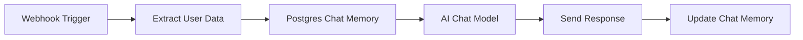

# Postgres Chat Memory Node

## 📋 Índice
1. [Introducción](#introducción)
2. [Requisitos Previos](#requisitos-previos)
3. [Configuración del Nodo](#configuración-del-nodo)
4. [Parámetros Principales](#parámetros-principales)
5. [Ejemplo Práctico](#ejemplo-práctico)
6. [Casos de Uso Comunes](#casos-de-uso-comunes)
7. [Mejores Prácticas](#mejores-prácticas)
8. [Troubleshooting](#troubleshooting)
9. [Recursos Adicionales](#recursos-adicionales)

---

## 🎯 Introducción

### ¿Qué es el nodo Postgres Chat Memory?
El nodo **Postgres Chat Memory** es una herramienta de N8N que permite almacenar y gestionar el historial de conversaciones en una base de datos PostgreSQL. Es especialmente útil para chatbots y aplicaciones de IA que requieren mantener contexto entre múltiples interacciones.

### ¿Cuándo usarlo?
- Chatbots que necesitan recordar conversaciones anteriores
- Aplicaciones de IA conversacional
- Sistemas de soporte al cliente automatizado
- Cualquier flujo que requiera persistencia de memoria de chat

---

## ⚙️ Requisitos Previos

### Conocimientos Necesarios
- Conceptos básicos de N8N
- Fundamentos de bases de datos PostgreSQL
- Comprensión básica de JSON y variables

### Recursos Técnicos
- ✅ Instancia de N8N funcionando
- ✅ Base de datos PostgreSQL accesible
- ✅ Credenciales de conexión a PostgreSQL
- ✅ Permisos de lectura/escritura en la base de datos

---

## 🔧 Configuración del Nodo

### Paso 1: Agregar el Nodo
1. Arrastra el nodo **Postgres Chat Memory** a tu workflow
2. Conecta el nodo con los nodos anteriores y posteriores según tu flujo

### Paso 2: Configuración Inicial
El nodo presenta dos pestañas principales:
- **Parameters**: Configuración principal del nodo
- **Settings**: Configuraciones avanzadas

---

## 📊 Parámetros Principales

### 1. Credential to connect with
```
Campo: Create new Cretentials
Tipo: Dropdown de credenciales
Descripción: Selecciona las credenciales de PostgreSQL configuradas previamente
```

**Configuración de Credenciales:**
- Ve a **Configuración → Credenciales**
- Crea nueva credencial tipo "PostgreSQL"
- Completa: Host, Puerto, Base de datos, Usuario, Contraseña


### 2. Session ID
```
Campo: Connected Chat Trigger Mode
Tipo: Dropdown
Opciones: [Múltiples opciones disponibles]
Descripción: Define cómo se identifica la sesión de chat
```

### 3. Session Key From Previous Node
```
Campo: {{ $json.sessionID }}
Valor actual: 2628a9481ae6464c972ce992aa883d43
Descripción: Clave única que identifica la sesión actual
```

**Ejemplo de configuración:**
```javascript
// Usando ID de usuario
{{ $json.userId }}

// Usando combinación de parámetros
{{ $json.userId + '_' + $json.channelId }}

// Usando timestamp para sesiones temporales
{{ $json.sessionStart }}
```

### 4. Table Name
```
Campo: n8n_chat_histories
Tipo: Texto
Descripción: Nombre de la tabla donde se almacenarán los historiales
```

**Estructura de tabla recomendada:**
```sql
CREATE TABLE n8n_chat_histories (
    id SERIAL PRIMARY KEY,
    session_id VARCHAR(255) NOT NULL,
    message_data JSONB NOT NULL,
    created_at TIMESTAMP DEFAULT CURRENT_TIMESTAMP,
    updated_at TIMESTAMP DEFAULT CURRENT_TIMESTAMP
);
```

### 5. Context Window Length
```
Campo: 5
Tipo: Número (Fixed/Expression)
Descripción: Número de interacciones pasadas que se incluyen como contexto
```

---

## 💡 Ejemplo Práctico

### Caso: Chatbot de Soporte al Cliente



### Configuración paso a paso:

#### 1. Webhook Trigger
```json
{
  "userId": "user_123",
  "message": "Hola, necesito ayuda con mi pedido",
  "timestamp": "2024-06-16T10:30:00Z"
}
```

#### 2. Extract User Data
```javascript
// Código del nodo Code
return [{
  json: {
    sessionID: `support_${$json.userId}`,
    userMessage: $json.message,
    timestamp: $json.timestamp
  }
}];
```

#### 3. Postgres Chat Memory
- **Credential**: Tu conexión PostgreSQL
- **Session ID**: `{{ $json.sessionID }}`
- **Table Name**: `support_chat_histories`
- **Context Window**: `10`

#### 4. AI Chat Model
El contexto previo estará disponible para el modelo de IA:
```javascript
// El nodo anterior proporciona:
{
  "chatHistory": [
    {"role": "user", "content": "mensaje anterior 1"},
    {"role": "assistant", "content": "respuesta anterior 1"},
    // ... hasta 10 interacciones
  ],
  "currentMessage": "nuevo mensaje del usuario"
}
```

---

## 🎯 Casos de Uso Comunes

### 1. Chatbot Multicanal
```javascript
// Session ID diferenciado por canal
sessionID: `${$json.userId}_${$json.platform}_${$json.channelId}`
```

### 2. Soporte Técnico
```javascript
// Session ID con categoría de problema
sessionID: `support_${$json.ticketCategory}_${$json.userId}`
```

### 3. Asistente Virtual Personal
```javascript
// Session ID simple por usuario
sessionID: `assistant_${$json.userId}`
```

### 4. Chat Temporal/Anónimo
```javascript
// Session ID basado en IP y timestamp
sessionID: `temp_${$json.clientIP}_${$json.sessionStart}`
```

---

## ✅ Mejores Prácticas

### Gestión de Sesiones
- **Usa IDs únicos y descriptivos** para las sesiones
- **Implementa limpieza periódica** de sesiones antiguas
- **Considera el ciclo de vida** de las conversaciones

### Optimización de Base de Datos
```sql
-- Índices recomendados
CREATE INDEX idx_session_id ON n8n_chat_histories(session_id);
CREATE INDEX idx_created_at ON n8n_chat_histories(created_at);

-- Limpieza automática (ejecutar periódicamente)
DELETE FROM n8n_chat_histories 
WHERE created_at < NOW() - INTERVAL '30 days';
```

### Configuración del Context Window
- **Para chats cortos**: 3-5 interacciones
- **Para soporte técnico**: 10-15 interacciones  
- **Para conversaciones largas**: 20-30 interacciones
- **Considera el límite de tokens** de tu modelo de IA

### Seguridad
- **Encripta datos sensibles** antes de almacenar
- **Implementa rotación de credenciales** regularmente
- **Audita accesos** a la base de datos
- **Cumple con GDPR/CCPA** si es aplicable

---

## 🛠️ Troubleshooting

### Error: "Connection to database failed"
**Solución:**
1. Verifica las credenciales de PostgreSQL
2. Confirma que la base de datos está accesible
3. Revisa configuración de firewall/VPN
4. Prueba la conexión desde N8N

### Error: "Table does not exist"
**Solución:**
```sql
-- Crear la tabla manualmente
CREATE TABLE IF NOT EXISTS n8n_chat_histories (
    id SERIAL PRIMARY KEY,
    session_id VARCHAR(255) NOT NULL,
    data JSONB NOT NULL,
    created_at TIMESTAMP DEFAULT CURRENT_TIMESTAMP
);
```

### Error: "Session ID is undefined"
**Solución:**
- Verifica que el nodo anterior proporcione el campo correcto
- Usa el editor de expresiones para debuggear: `{{ Object.keys($json) }}`
- Asegúrate de que la sintaxis de la expresión sea correcta

### Rendimiento Lento
**Solución:**
- Reduce el Context Window Length
- Optimiza índices de base de datos
- Implementa paginación para historiales largos
- Considera usar conexión pool

---

## 📚 Recursos Adicionales

### Documentación Oficial
- [N8N Postgres Integration](https://docs.n8n.io)
- [PostgreSQL Documentation](https://www.postgresql.org/docs/)

### Plantillas de Workflow
- Chatbot básico con memoria
- Sistema de soporte multicanal
- Asistente virtual personalizado

### Comunidad
- [N8N Community Forum](https://community.n8n.io)
- [Discord de N8N](https://discord.gg/n8n)

---

## 📝 Plantilla de Tutorial para Futuros Nodos

### Estructura Recomendada:
1. **Introducción** - Qué hace el nodo y cuándo usarlo
2. **Requisitos Previos** - Conocimientos y recursos necesarios
3. **Configuración del Nodo** - Pasos de instalación/configuración
4. **Parámetros Principales** - Explicación detallada de cada campo
5. **Ejemplo Práctico** - Caso de uso real paso a paso
6. **Casos de Uso Comunes** - Múltiples escenarios de aplicación
7. **Mejores Prácticas** - Recomendaciones y optimizaciones
8. **Troubleshooting** - Errores comunes y soluciones
9. **Recursos Adicionales** - Enlaces y referencias útiles

### Elementos Clave:
- ✅ **Ejemplos de código** con sintaxis correcta
- ✅ **Capturas de pantalla** cuando sea necesario
- ✅ **Diagramas de flujo** para visualizar workflows
- ✅ **Configuraciones paso a paso** detalladas
- ✅ **Casos de uso reales** y prácticos
- ✅ **Sección de troubleshooting** completa

