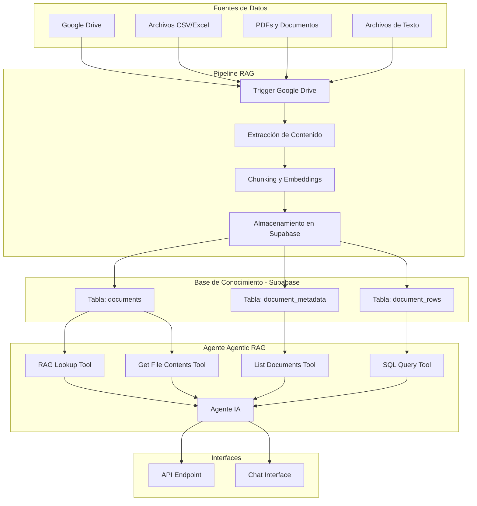
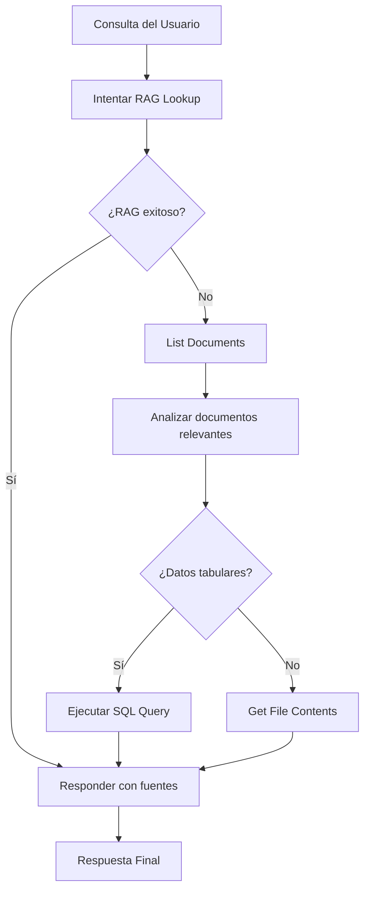

# Visión General - Arquitectura Agentic RAG

## Introducción

El sistema Agentic RAG representa una evolución significativa del RAG tradicional, donde en lugar de depender únicamente de búsquedas vectoriales, el agente de IA tiene acceso a múltiples herramientas para explorar y analizar la base de conocimiento de manera inteligente.

## Arquitectura del Sistema

### Componentes Principales

### Estructura de Datos en Supabase

#### 1. Tabla `documents`
- **Propósito**: Almacena chunks de documentos con embeddings para RAG
- **Campos principales**:
  - `content`: Contenido del chunk
  - `embedding`: Vector embedding del contenido
  - `metadata`: Información como file_id y file_title

#### 2. Tabla `document_metadata`
- **Propósito**: Metadatos de alto nivel de documentos
- **Campos principales**:
  - `file_id`: Identificador único del archivo
  - `title`: Título del documento
  - `url`: URL para citar fuentes
  - `schema`: Esquema para archivos tabulares (CSV/Excel)

#### 3. Tabla `document_rows`
- **Propósito**: Almacena datos tabulares como JSON para consultas SQL
- **Campos principales**:
  - `data_set_id`: file_id del archivo fuente
  - `row_data`: Datos de la fila en formato JSONB

## Flujo de Trabajo Principal

### Fase 1: Configuración Inicial
1. **Creación de Tablas en Supabase**
   - Ejecuta queries para crear las 3 tablas principales
   - Configura índices y relaciones necesarias

### Fase 2: Pipeline RAG
1. **Detección de Archivos**: Trigger de Google Drive detecta nuevos/actualizados archivos
2. **Procesamiento en Lote**: Loop maneja múltiples archivos simultáneamente
3. **Limpieza de Datos**: Elimina datos antiguos del archivo si es una actualización
4. **Extracción de Contenido**:
   - **CSV/Excel**: Extrae filas → document_rows + convierte a texto para RAG
   - **Documentos**: Extrae texto directamente
5. **Chunking y Embeddings**: Procesa contenido para almacenamiento vectorial
6. **Almacenamiento**: Inserta en Supabase con metadatos apropiados

### Fase 3: Operación del Agente

#### Herramientas Disponibles

1. **RAG Lookup Tool**
   - Búsqueda vectorial tradicional
   - Incluye metadatos para citación de fuentes
   - Primera opción para la mayoría de consultas

2. **List Documents Tool**
   - Lista todos los documentos disponibles
   - Permite al agente razonar sobre qué documentos revisar
   - Incluye esquemas para archivos tabulares

3. **Get File Contents Tool**
   - Obtiene contenido completo de un documento específico
   - Útil cuando RAG no encuentra información suficiente
   - Requiere file_id de List Documents

4. **SQL Query Tool**
   - Ejecuta consultas SQL sobre datos tabulares
   - Permite análisis complejos (sumas, promedios, agrupaciones)
   - Usa JSONB para flexibilidad en esquemas

#### Estrategia de Decisión del Agente

## Ventajas Clave del Sistema

### 1. **Flexibilidad de Exploración**
- No limitado a chunks específicos
- Puede analizar documentos completos
- Acceso directo a datos tabulares

### 2. **Análisis de Datos Avanzado**
- Consultas SQL sobre CSV/Excel
- Cálculos agregados (sumas, promedios, máximos)
- Análisis de tendencias en spreadsheets

### 3. **Mejor Contexto**
- Capacidad de conectar información entre documentos
- Acceso a metadatos para mejor comprensión
- Citación precisa de fuentes

### 4. **Recuperación Inteligente**
- Fallback automático cuando RAG falla
- Selección inteligente de documentos relevantes
- Múltiples estrategias de búsqueda

## Consideraciones de Rendimiento

### Escalabilidad
- **Documentos pequeños**: Sistema manejable hasta ~1000 documentos
- **Documentos grandes**: Considerar filtrado por fecha o categoría
- **Consultas SQL**: Rendimiento depende del tamaño de datos tabulares

### Optimizaciones Recomendadas
- Ajustar estrategia de chunking según tipo de contenido
- Optimizar prompts del sistema para casos de uso específicos
- Considerar modelos más potentes para análisis complejos
- Implementar caché para consultas frecuentes

## Limitaciones Actuales

1. **Esquemas Dinámicos**: No detecta tipos de datos automáticamente
2. **Eliminación de Archivos**: No hay trigger para archivos eliminados
3. **Prompts Básicos**: Sistema de prompts mejorable para casos específicos
4. **Modelo Base**: GPT-4 mini puede ser limitado para análisis complejos

## Extensibilidad

El sistema está diseñado para ser extensible:
- **Nuevos tipos de archivo**: Agregar nodos de extracción
- **Herramientas adicionales**: Crear tools personalizadas
- **Fuentes de datos**: Cambiar Google Drive por otras fuentes
- **Modelos IA**: Intercambiar modelos según necesidades

## Casos de Uso Ideales

1. **Análisis de Documentos Empresariales**
2. **Investigación sobre Conjuntos de Datos**
3. **Consultas Complejas sobre Spreadsheets**
4. **Análisis Cross-Document**
5. **Sistemas de Soporte con Documentación Técnica**